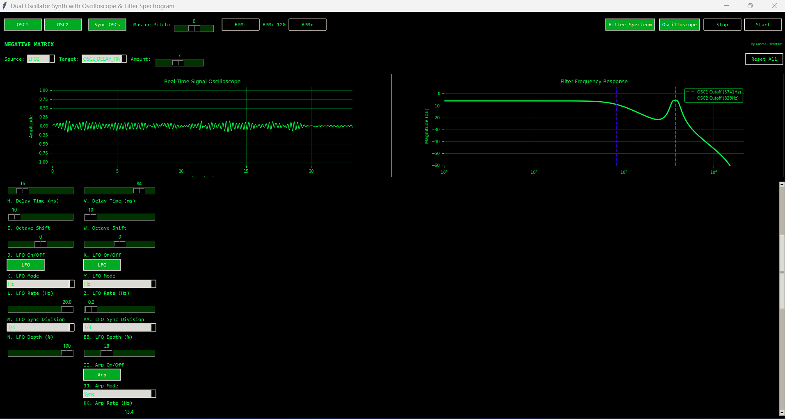

# NEGATIVE MATRIX
### *Break Free From Generic Sounds*

<div align="center">



**A revolutionary 4-oscillator psychedelic synthesizer designed for producers who refuse to sound like everyone else.**

[](https://www.python.org/)
[](LICENSE)
[]()

[🚀 Quick Start](#-quick-start) • [✨ Features](#-core-features) • [🎹 For Producers](#-why-producers-choose-negative-matrix) • [📖 Documentation](#-documentation)

</div>

---

## 🎯 THE PROBLEM WITH MODERN PRODUCTION

You've heard it. That **same lead**. That **same bassline**. That **same preset** everyone downloaded from the same pack.

Your tracks sound professional, but they don't sound like **YOU**.

You're tired of:
- Digging through 10,000 presets that all sound the same
- Fighting with complicated synthesizers that kill your creative flow
- Settling for "close enough" because modulation routing is a nightmare
- Watching your unique ideas get buried under generic sounds

---

## 🔥 THE SOLUTION: NEGATIVE MATRIX

**Negative Matrix** isn't just another synthesizer. It's a creative weapon built specifically for **psytrance, techno, and experimental producers** who need sounds that stand out in a saturated market.

### 🎨 Design Philosophy

> "If your tools encourage you to sound like everyone else, you need better tools."

Negative Matrix was born in late-night studio sessions, crafted for one purpose: **to give you sounds that nobody else has access to.**

---

## ✨ CORE FEATURES

### 🌊 **4 Independent Oscillator Engines**
Each oscillator is a complete synthesis powerhouse with its own personality:
- **5 Waveforms**: Sine, Saw, Square, Triangle, Sample & Hold
- **50Hz - 5kHz Range**: Perfect for sub-bass to screaming leads
- **Individual Processing**: Each osc has its own filter, envelope, LFO, delay, and effects

### 🎛️ **The Modulation Matrix (The Secret Weapon)**
This is where magic happens. Route **any LFO to any parameter** with bipolar modulation:
- **Sources**: 4 independent LFOs (one per oscillator)
- **Targets**: Frequency, Cutoff, Resonance, Delay Time, Delay Amount
- **Depth**: -100% to +100% (negative values for inverted modulation)
- **Multiple Connections**: One LFO can control multiple parameters simultaneously

**Real Talk**: This is the feature that makes your sounds **unmistakably yours**. While others are clicking through presets, you're designing movement and life from scratch.

### 🎚️ **5-Stage Filter System**
Professional filters that actually respond musically:
- **Lowpass, Highpass, Bandpass, Notch, Comb**
- **100Hz - 8kHz Range** with precision control
- **Resonance 0.1 - 2.0**: From subtle to screaming self-oscillation
- **Real-time Spectrum Analyzer**: See your filter curve as you tweak

### 📈 **ADSR Envelopes That Make Sense**
Responsive, musical envelopes for each oscillator:
- **Attack/Decay/Release**: 1-5000ms (yes, FIVE SECONDS)
- **Sustain**: 0-100% with smooth transitions
- **Retriggerable**: Perfect for rhythmic psytrance patterns
- **Global or Individual Control**: Trigger all oscs or just one

### 💫 **Psychedelic Effects Suite**
Built-in effects designed specifically for psychedelic and electronic music:

#### **Psy Distortion**
Three waveshaping algorithms for harmonic enhancement:
- **Soft**: Warm, musical saturation (perfect for basslines)
- **Hard**: Aggressive clipping for industrial sounds
- **Tube**: Exponential curve warmth (analog character)
- **Drive**: 1.0-10.0 intensity control

#### **Psy Chorus**
Three-voice modulated delay for spatial depth:
- **Mix**: 0-100% wet/dry balance
- **Rate**: 0.1-5.0 Hz modulation speed
- **Depth**: 0-100% modulation intensity
- **120° Phase Offset**: Natural, wide stereo field

#### **Psy Gate**
BPM-synchronized rhythmic amplitude modulation:
- **Depth**: 0-100% gate intensity
- **Rate**: 1-32 (from whole notes to 32nd notes)
- **16-Step Pattern**: Pre-programmed full-on psytrance pattern `[1,0,1,0,1,0,1,1,1,0,1,0,1,1,0,1]`

#### **FM Synthesis**
Classic frequency modulation for complex timbres:
- **Amount**: 0-100% modulation depth
- **Ratio**: 0.1-8.0 (carrier:modulator)

#### **Forest Noise**
Random burst generator for organic textures:
- **Amount**: 0-100% noise level
- Perfect for psytrance forest atmospheres

### 🔄 **Advanced LFO System**
Four independent LFOs with powerful sync capabilities:

**Two Operating Modes:**
- **Hz Mode**: Direct frequency control (0.1-20 Hz)
- **Sync Mode**: Tempo-locked to master BPM

**Sync Divisions:**
- 1/1 (whole notes) → 1/16 (sixteenth notes)
- Perfect for creating evolving, rhythmic modulations

**Pro Tip**: Use different LFO rates on different oscillators for polyrhythmic complexity that makes tracks feel alive.

### 🎹 **Intelligent Arpeggiator**
8-step programmable arpeggiator with:
- **Per-Step Semitone Offset**: -24 to +24 semitones
- **Per-Step Octave Transpose**: -4 to +4 octaves
- **Hz or Sync Mode**: Free-running or tempo-locked
- **Real-time Pattern Editing**: Changes apply immediately

### ⏱️ **Per-Oscillator Delay**
Individual delay for each oscillator:
- **Amount**: 0-100% (feedback control)
- **Time**: 10-1000ms
- **Applications**: Echo, doubling, reverb simulation, rhythmic effects

### 📊 **Real-Time Visualization**
Professional-grade visual feedback:

**Oscilloscope (Left Panel)**
- Live waveform display
- 1024 sample buffer (~23ms at 44.1kHz)
- 20Hz refresh rate
- Full 32-bit float precision

**Filter Spectrum Analyzer (Right Panel)**
- Real-time frequency response
- Color-coded cutoff markers for all oscillators
- Logarithmic scale (10Hz - 22kHz)
- -60dB to 0dB magnitude range

### 💾 **Comprehensive Preset System**
Save and recall your entire creative state:
- **JSON Format**: Human-readable, easy to share
- **Complete State Capture**: Every parameter, every modulation connection
- **Cross-Platform**: Works on Windows, macOS, Linux
- **Instant Loading**: No confirmation popups (coming in next update)
- **Included Presets**: Danger, Forest, Deep, and more

---

## 🎹 WHY PRODUCERS CHOOSE NEGATIVE MATRIX

### For **Psytrance Producers**:
- **Full-On Leads**: Aggressive filter sweeps with LFO→Cutoff modulation
- **Rolling Basslines**: Layered oscillators with offset LFO phases
- **Psychedelic Textures**: Forest noise + chorus + gate effects
- **Rhythmic Complexity**: Per-oscillator gates synced to different divisions

### For **Techno Producers**:
- **Industrial Basses**: Hard distortion + resonant filters
- **Hypnotic Loops**: Arpeggiator with subtle LFO pitch modulation
- **Acid Lines**: Highpass filters with extreme resonance
- **Textural Layers**: Sample & Hold waveforms with delay

### For **Experimental Sound Designers**:
- **Generative Sequences**: Multiple LFOs creating evolving patterns
- **Spectral Morphing**: FM synthesis + filter sweeps
- **Glitch Effects**: Sample & Hold + fast arpeggiator + gate
- **Otherworldly Atmospheres**: Comb filters + chorus + long delays

---

## 🚀 QUICK START

### Installation

```bash
# Clone the repository
git clone https://github.com/gabrieltrentini/negative-matrixV0.1.git

# Navigate to directory
cd negative-matrixV0.1

# Install dependencies
pip install -r requirements.txt

# Launch Negative Matrix
python Osc14_synth.py
```

### Dependencies
- **Python 3.7+**
- **NumPy**: DSP and mathematical operations
- **SciPy**: Advanced filter design
- **sounddevice**: Real-time audio I/O
- **tkinter**: GUI framework
- **matplotlib**: Real-time visualization

### System Requirements

**Minimum:**
- Dual-core 2.0GHz CPU
- 512MB RAM
- Python 3.7+
- Any audio interface

**Recommended:**
- Quad-core 3.0GHz+ CPU (for 4 simultaneous oscillators)
- 2GB+ RAM
- Professional audio interface for low latency
- 1920x1080+ display

---

## 💡 WORKFLOW EXAMPLES

### 🔊 Creating a Psytrance Lead

1. **Enable OSC1** with saw wave at ~800Hz
2. **Set lowpass filter** cutoff to ~2kHz, resonance to 1.5
3. **Enable LFO1** in Sync mode at 1/8 division
4. **Route LFO1→OSC1_CUTOFF** at +80% in Modulation Matrix
5. **Add Psy Distortion** (Soft, Drive 3.0)
6. **Trigger envelope** and adjust ADSR to taste

**Result**: Classic psytrance lead with filter sweep

### 🌊 Building a Rolling Bassline

1. **Enable OSC1** with sine wave at 110Hz (A2)
2. **Enable OSC2** with triangle wave at 55Hz (A1)
3. **Toggle "Sync OSCs"** to mix both oscillators
4. **Enable LFO1** at 0.2Hz, **LFO2** at 0.15Hz (create phase drift)
5. **Route LFO1→OSC1_FREQ** at -20%, **LFO2→OSC2_FREQ** at +15%
6. **Add subtle Psy Chorus** (Mix 25%, Rate 0.5Hz)

**Result**: Hypnotic, evolving sub-bass with organic movement

### ⚡ Designing an Acid Stab

1. **Enable OSC1** with square wave at ~440Hz
2. **Set highpass filter**, cutoff at 800Hz, resonance to 1.8
3. **Enable Arpeggiator**, Sync mode at 1/16
4. **Program 8-step sequence**: [0, 7, 12, 19, 12, 7, 3, -5] semitones
5. **Short envelope**: Attack 10ms, Decay 200ms, Sustain 0%, Release 100ms
6. **Add Hard Distortion** (Drive 5.0)

**Result**: Classic acid house stab with modern aggression

---

## 🎓 ADVANCED TECHNIQUES

### **Polyrhythmic Modulation**
Use different LFO sync divisions across oscillators:
- OSC1: LFO synced to 1/4 notes
- OSC2: LFO synced to 1/6 notes (triplets)
- OSC3: LFO synced to 1/8 notes
- **Result**: Complex, evolving patterns that never repeat the same way

### **Negative Modulation for Counterpoint**
Route the same LFO to multiple parameters with opposite polarities:
- LFO1→OSC1_CUTOFF at +60%
- LFO1→OSC1_RESONANCE at -40%
- **Result**: As filter opens, resonance decreases (natural, musical movement)

### **Layered Movement**
Stack modulations for intricate evolution:
- LFO1→OSC1_FREQ at +10% (slow pitch drift)
- LFO2→OSC1_CUTOFF at +80% (filter sweep)
- LFO3→OSC1_DELAY_TIME at +50% (rhythmic delay modulation)
- **Result**: Three-dimensional movement that keeps listeners engaged

### **Spectral Stacking**
Create rich, evolving tones with harmonic relationships:
- OSC1: 220Hz (fundamental)
- OSC2: 440Hz (octave)
- OSC3: 660Hz (perfect fifth)
- OSC4: 880Hz (two octaves)
- **Apply different LFO rates to each oscillator's cutoff**
- **Result**: Evolving harmonic complexity, sounds huge and unique

---

## 🗺️ ROADMAP

### 🔧 **v0.2 - Workflow Refinement** (In Progress)
- ✅ Fix mousewheel scroll for OSC1-3 (currently only OSC4 works)
- ✅ Implement keyboard input + GUI (Sylenth-style, notes A-L)
- ✅ Octave shifting with Z/X keys
- ✅ Fix BPM limits: min 20, max 999
- ✅ Direct preset switching (no confirmation popups)
- ✅ Proper GUI/process termination on window close
- ✅ Complete parameter mapping expansion

### 🎨 **v0.3 - GUI Evolution**
- 🎯 GUI refinement inspired by Vital and Serum
- 🎯 Visual LFO editors (draw your own LFO shapes)
- 🎯 Drag-and-drop modulation routing
- 🎯 Frequency range expansion: 20Hz - 20kHz
- 🎯 Analog mode (vintage oscillator modeling)
- 🎯 Additional waveforms (wavetable support)

### ⚙️ **v0.4 - Advanced Synthesis**
- 🔮 FM synthesis expansion
- 🔮 AM (Amplitude Modulation) synthesis
- 🔮 Granular synthesis engine
- 🔮 Additive synthesis capabilities
- 🔮 Random synthesis generator
- 🔮 Modular routing system

### 🚀 **v1.0 - Professional Release**
- 🌟 Port to JUCE + C++ (performance optimization)
- 🌟 CPU/memory optimization
- 🌟 Universal MIDI compatibility
- 🌟 VST/AU/AAX plugin format
- 🌟 Preset marketplace integration
- 🌟 Enhanced security and stability

---

## 📖 DOCUMENTATION

Full technical documentation available in **[Negative Matrix Documentation.pdf](docs/)**

**Covered Topics:**
- Complete parameter reference
- Signal flow architecture
- Advanced modulation techniques
- Filter theory and applications
- Preset management
- Troubleshooting guide
- Performance optimization
- Future development plans

---

## 🤝 CONTRIBUTING

Negative Matrix is open-source and welcomes contributions from producers and developers who want to push boundaries.

**Ways to Contribute:**
- 🐛 **Bug Reports**: Found an issue? Let us know
- 💡 **Feature Requests**: Have an idea? Share it
- 🎨 **Preset Contributions**: Create unique presets to share
- 💻 **Code Contributions**: PRs welcome for features and fixes
- 📖 **Documentation**: Help improve tutorials and guides

---

## 📜 LICENSE

Open Source - Free for personal and commercial use.

---

## 🎤 FINAL WORDS

**Negative Matrix** isn't for everyone. It's not a "download 10,000 presets and hope for the best" synthesizer.

It's for producers who:
- Want to **own their sound**
- Understand that **unique takes work**
- Enjoy the **creative process** as much as the result
- Are willing to **experiment and fail** on the path to breakthrough sounds

If you're tired of sounding like everyone else, **Negative Matrix** is your creative rebellion.

---

<div align="center">

### 🌟 MAKE SOUNDS THAT MATTER

**Created by Gabriel Trentini // TNTEC Audio Technologies **

[](https://github.com/gabrieltrentini)

*"In a world of presets, be a sound designer."*

---

**[⬆ Back to Top](#negative-matrix)**

</div>
